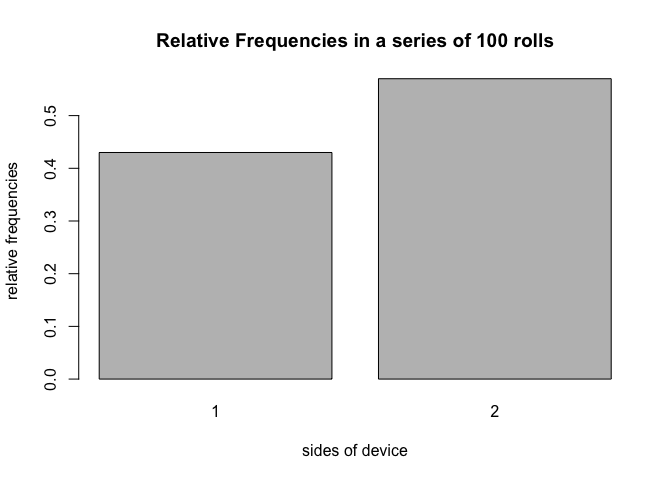

``` r
knitr::opts_chunk$set(
  collapse = TRUE,
  comment = "#>",
  fig.path = "README-"
)
```

Overview
--------

`"roller"` is an [R](http://www.r-project.org/) package that allows us to simulate rolling a die/device.

-   `device()` creates a dice object (of class `"device"`)
-   `roll()` rolls a device object, yielding a `rolls` object.
-   `plot()` method for a `"rolls"` object to plot frequencies of each side rolled.
-   `summary()` method for a `"rolls"` object gives a frequency table of the sides rolled.
-   `"["` extract method for a `"rolls"` object extracts the element at the nth roll.
-   `"[<-"` method allows us to change certain rolls outcomes.
-   `"+"` method adds rolls to an already-rolled rolls object.

Motivation
----------

This package has been created to satisfy a homework problem, and also to learn the tools necessary to create a fully functional R package.

Installation
------------

Install the development version from GitHub via the package `"devtools"`:

``` r
# development version from GitHub:
#install.packages("devtools") 
# install "roller" (without vignettes)
devtools::install_github("colefh/Workout3/roller")
# install "roller" (with vignettes)
devtools::install_github("colefh/Workout3/roller", build_vignettes = TRUE)
```

Usage
-----

``` r
library(roller)
# default die
device1 <- device()
device1
#> object "device"
#> 
#> "1", p = 0.5 
#> "1", p = 0.5

# 1 roll of device1
roll(device1, times = 1)
#> object "rolls"
#> 
#> $rolls
#> [1] 2

# 10 rolls of device1
roll10 <- roll(device1, times = 10)
roll10
#> object "rolls"
#> 
#> $rolls
#>  [1] 2 2 1 1 1 2 1 1 1 1

# summary
summary(roll10)
#> summary "rolls"
#> 
#>   side count prop
#> 1    1     7  0.7
#> 2    2     3  0.3

# 100 rolls
roll100 <- roll(device1, times = 100)

# summary
summary(roll100)
#> summary "rolls"
#> 
#>   side count prop
#> 1    1    43 0.43
#> 2    2    57 0.57

# plot
plot(roll100)
```



``` r

# extract
roll100[100]
#> $<NA>
#> NULL

# change
roll100[100] <- 1
```
